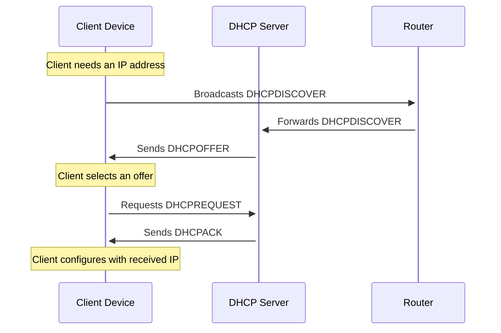
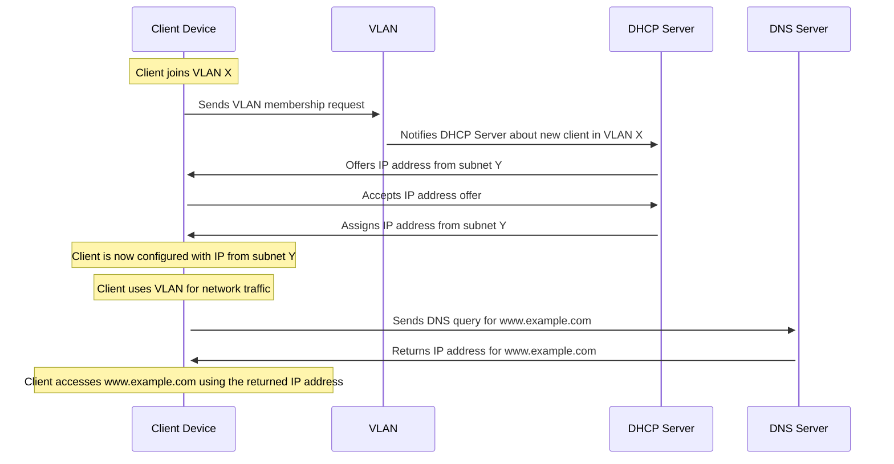
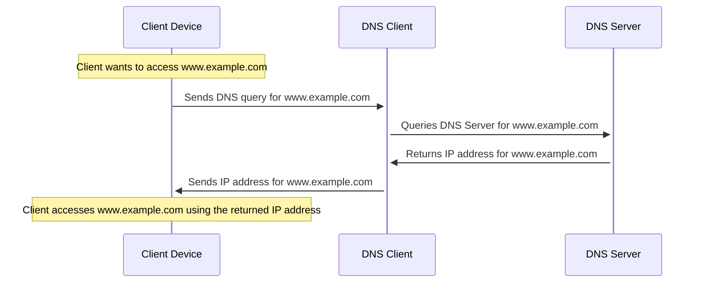
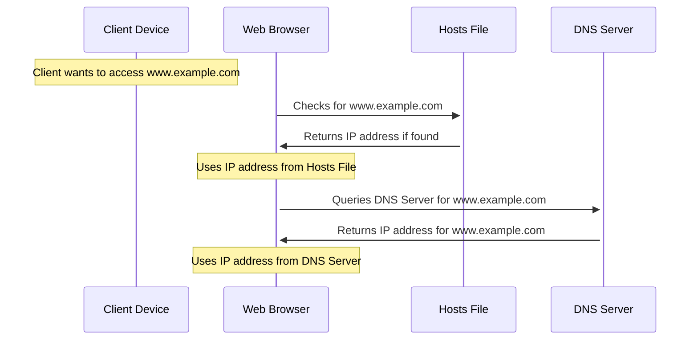
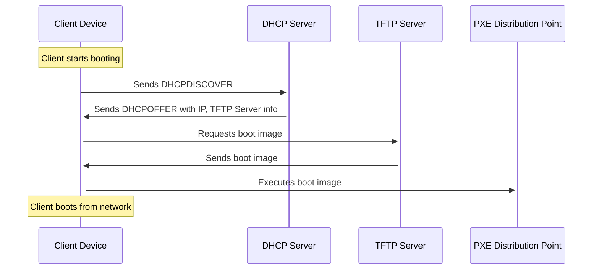
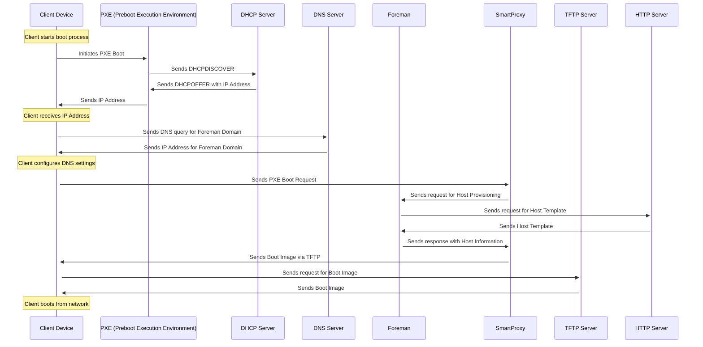

<!DOCTYPE html>
<html lang="en">
   <head>
	 
    </head>
	 
<body>
 <pre><code class="language-mermaid">graph LR
A--&gt;B
</code></pre>

graph LR
A--&gt;B

	
</body>

</html>

- this might be a little redundant at the moment, but i thought its better to explain everything step after step, so the diagramms wont get to large
### DHCP

### Subnets and VLAN

> - MAAS:
> 	- Focus: Direct management of VLANs and subnets within the platform itself.
> 	- Functionality: Allows creation and management of multiple VLANs, supporting both tagged and untagged VLANs on managed switches. Each fabric has a default VLAN, with additional VLANs added for logical separation within the same physical infrastructure.
> - Foreman:
> 	- Focus: Primarily focused on provisioning hosts and configuring their network settings.
> 	- Functionality: Can provision hosts across various subnets but does not directly manage VLANs. Requires separate network-level configuration for creating and managing VLANs.
> In essence, MAAS offers integrated VLAN and subnet management within its environment, whereas Foreman focuses on host provisioning and network configuration, leaving VLAN management to external network administration.

### DNS

- [do routers have dns?](https://superuser.com/questions/1715361/do-routers-have-a-dns-server)
... 
> - most SOHO routers have a built-in DNS server to act as a cache. It's not a mandatory "router" feature though – enterprise networks would run their DNS on a separate system instead.
> - **If this is so, then I guess that DNS server would just be another cache similar to the one in Windows...or is it a more advanced DNS server?**
> 	- It varies between products. Talking about SOHO routers, the router's own DNS server is pretty much always just a caching proxy and actual name resolution relies on forwarding requests to an upstream resolver; no root hints involved.
> 	- But in addition to that, it is also quite common for the router to be authoritative for some "local" domain (like .lan or .home or .dlink) which contains hostnames for your LAN hosts. This integrates with the router's DHCP service, collecting hostnames that devices provide in their lease requests. It may even support static entries, though in SOHO routers it's rarely anything more than a single 'A' record per name.
- why does foreman require dns?
> - To provision with Foreman, the DNS domain of the router is essential because Foreman requires defined domain names for every host in the network. These domain names are crucial for managing A-, AAAA-, and PTR resource records. Even if Foreman doesn't manage your DNS servers, you still need to create at least one domain and assign it. Domains are part of the naming conventions that Foreman uses for hosts, for example, a host named test123 in the example.com domain has the fully qualified domain name test123.example.com.
> - During the DNS record creation process, Foreman performs conflict DNS answers to ensure that the hostname is not actively being used. This check is performed against one of the following DNS servers:
>  	- The system-wide resolver, if under Administer > Settings > Query local nameservers the option true is enabled.
>  	- The nameservers defined in the subnet agreement with the host.
>  	- The authoritative NS-records derived from the SOA (Start of Authority) of the domain name associated with the host.
> - Therefore, knowing the domain name of the router is crucial for successful provisioning with Foreman to ensure that all DNS queries are handled correctly and no conflicts arise. This is particularly important when Foreman attempts to dynamically assign IP addresses or checks existing DNS entries to ensure that no IP addresses are duplicated.

### hosts file
> This diagram outlines the differences in the process of resolving a domain name using the hosts file versus a DNS server:
> - This sequence diagram simplifies the process for illustrative purposes. The actual process may involve additional steps, such as DNS caching and recursive queries, depending on the network infrastructure and protocols in use.

> - Using the Hosts File:
>	- The client's web browser first checks the hosts file for an entry corresponding to the domain name (www.example.com).
> 	- If an entry is found, the browser uses the IP address listed in the hosts file to connect to the website.
> 	- This method bypasses DNS resolution entirely, relying solely on local entries.
> - Using a DNS Server:
> 	- If the hosts file does not contain an entry for the domain, the browser queries a DNS server for the IP address associated with www.example.com.
> 	- The DNS server returns the IP address, which the browser then uses to establish a connection to the website.
> 	- This method relies on external DNS services to resolve domain names.
> The key difference lies in the source of the IP address used for accessing the website:
> - Hosts File: Provides static mappings of domain names to IP addresses on a local machine, taking precedence over DNS when resolving domain names locally.
> - DNS Server: Acts as a global directory service, dynamically resolving domain names to IP addresses based on the current state of the internet.

### PXE and TFTP
> This diagram outlines the basic steps involved in the PXE and TFTP boot process:

> - ***Client Starts Booting:*** The client device initiates the boot process.
> - ***Sends DHCPDISCOVER:*** The client sends a DHCPDISCOVER packet to discover available DHCP servers.
> - ***Receives DHCPOFFER:*** The DHCP server responds with a DHCPOFFER packet, providing the client with an IP address and the address of the TFTP server.
> - ***Requests Boot Image:*** The client requests the boot image from the TFTP server.
> - ***Sends Boot Image:*** The TFTP server sends the boot image to the client.
> - ***Executes Boot Image:*** The client executes the boot image, initiating the boot process from the network.

## Foreman Smartproxy  & Network Configuration Process
> This diagram provides a visual representation of the network configuration process, detailing how a client PC interacts with various components such as VLAN, DNS Server, DHCP in Router, and Storage during the boot process

 ***you made it trough the tutorial!!!***
