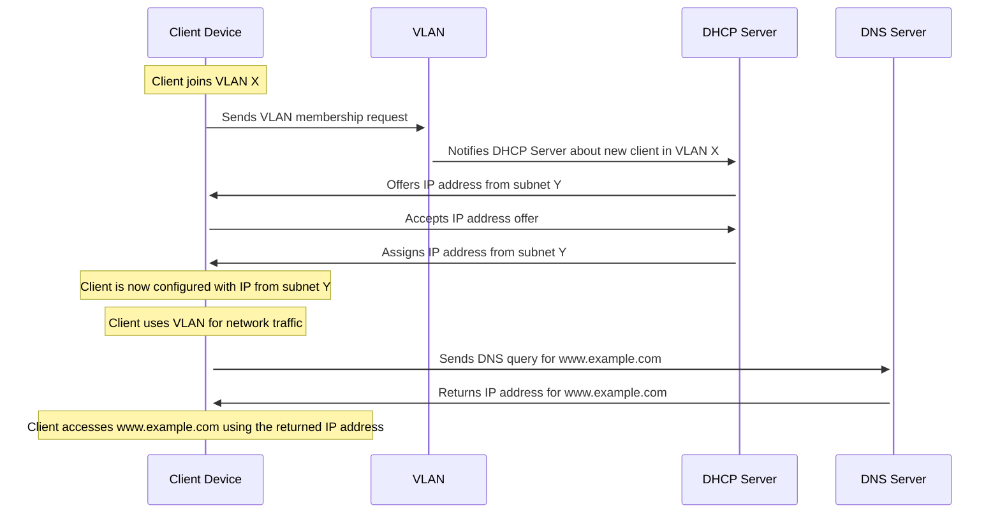
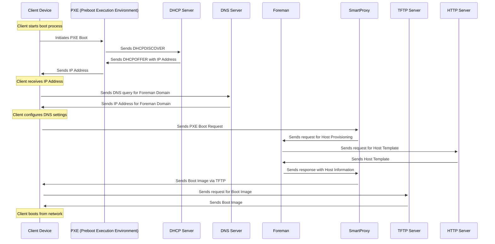

# Foreman 3.10 + Puppet + Katello + Discovery Plugin-Installation- &  PXE Beginners Guide for RHEL_9 (using local-DHCP&TFTP)
 
 In this Guide i will show you how to install Forman with puppet, katello and discovery plugin.
 You will also learn how to install and setup DHCP- and TFTP-Server.
 I will also show you how to setup Foreman and how to use the Foreman Boot Image via PXE.
You will be ready to discover and provision your physical servers and workstations after following this Guide.
> ***before we start:***
>  - foreman comes without its own dhcp/tftp unlike MAAS, Tinkerbell, etc
>    - you either need to have external dhcp, or you need to install the servers locally
>  - we will install and we will use Foreman on a single node ***without external DHCP***
>  -  we wont use  ***Smartproxy DNS*** since its not required if using a local DHCP 
>-  we install Discovery Plugin before setting up TFTP because we have less work
> - Its demanded that you install Foreman with Katello on a ***freshly provisioned machine***
>  	- you cannot install katello plugin if you installed foreman without it before
> -  make sure that you have a ***Backup*** before using the Installer
>    - *especially if you have set up Foreman successfully before*
>    - you can make backup by using:
>       - img (dd, gparted)
>       - rsync (standalone, or better: ***rsnapshot***)
> - we use `Rocky Linux 9.4` in this example
## Required Knowledge
- this might be a little redundant at the moment, but i thought its better to explain everything step after step, so the diagramms wont get to large
### DHCP

### Subnets and VLAN

> - MAAS:
> 	- Focus: Direct management of VLANs and subnets within the platform itself.
> 	- Functionality: Allows creation and management of multiple VLANs, supporting both tagged and untagged VLANs on managed switches. Each fabric has a default VLAN, with additional VLANs added for logical separation within the same physical infrastructure.
> - Foreman:
> 	- Focus: Primarily focused on provisioning hosts and configuring their network settings.
> 	- Functionality: Can provision hosts across various subnets but does not directly manage VLANs. Requires separate network-level configuration for creating and managing VLANs.
> In essence, MAAS offers integrated VLAN and subnet management within its environment, whereas Foreman focuses on host provisioning and network configuration, leaving VLAN management to external network administration.

### DNS


- [do routers have dns?](https://superuser.com/questions/1715361/do-routers-have-a-dns-server)
... 
> - most SOHO routers have a built-in DNS server to act as a cache. It's not a mandatory "router" feature though – enterprise networks would run their DNS on a separate system instead.
> - **If this is so, then I guess that DNS server would just be another cache similar to the one in Windows...or is it a more advanced DNS server?**
> 	- It varies between products. Talking about SOHO routers, the router's own DNS server is pretty much always just a caching proxy and actual name resolution relies on forwarding requests to an upstream resolver; no root hints involved.
> 	- But in addition to that, it is also quite common for the router to be authoritative for some "local" domain (like .lan or .home or .dlink) which contains hostnames for your LAN hosts. This integrates with the router's DHCP service, collecting hostnames that devices provide in their lease requests. It may even support static entries, though in SOHO routers it's rarely anything more than a single 'A' record per name.
- why does foreman require dns?
> - To provision with Foreman, the DNS domain of the router is essential because Foreman requires defined domain names for every host in the network. These domain names are crucial for managing A-, AAAA-, and PTR resource records. Even if Foreman doesn't manage your DNS servers, you still need to create at least one domain and assign it. Domains are part of the naming conventions that Foreman uses for hosts, for example, a host named test123 in the example.com domain has the fully qualified domain name test123.example.com.
> - During the DNS record creation process, Foreman performs conflict DNS answers to ensure that the hostname is not actively being used. This check is performed against one of the following DNS servers:
>  	- The system-wide resolver, if under Administer > Settings > Query local nameservers the option true is enabled.
>  	- The nameservers defined in the subnet agreement with the host.
>  	- The authoritative NS-records derived from the SOA (Start of Authority) of the domain name associated with the host.
> - Therefore, knowing the domain name of the router is crucial for successful provisioning with Foreman to ensure that all DNS queries are handled correctly and no conflicts arise. This is particularly important when Foreman attempts to dynamically assign IP addresses or checks existing DNS entries to ensure that no IP addresses are duplicated.

### hosts file
> This diagram outlines the differences in the process of resolving a domain name using the hosts file versus a DNS server:
> - This sequence diagram simplifies the process for illustrative purposes. The actual process may involve additional steps, such as DNS caching and recursive queries, depending on the network infrastructure and protocols in use.


> - Using the Hosts File:
>	- The client's web browser first checks the hosts file for an entry corresponding to the domain name (www.example.com).
> 	- If an entry is found, the browser uses the IP address listed in the hosts file to connect to the website.
> 	- This method bypasses DNS resolution entirely, relying solely on local entries.
> - Using a DNS Server:
> 	- If the hosts file does not contain an entry for the domain, the browser queries a DNS server for the IP address associated with www.example.com.
> 	- The DNS server returns the IP address, which the browser then uses to establish a connection to the website.
> 	- This method relies on external DNS services to resolve domain names.
> The key difference lies in the source of the IP address used for accessing the website:
> - Hosts File: Provides static mappings of domain names to IP addresses on a local machine, taking precedence over DNS when resolving domain names locally.
> - DNS Server: Acts as a global directory service, dynamically resolving domain names to IP addresses based on the current state of the internet.

### PXE and TFTP
> This diagram outlines the basic steps involved in the PXE and TFTP boot process:


> - ***Client Starts Booting:*** The client device initiates the boot process.
> - ***Sends DHCPDISCOVER:*** The client sends a DHCPDISCOVER packet to discover available DHCP servers.
> - ***Receives DHCPOFFER:*** The DHCP server responds with a DHCPOFFER packet, providing the client with an IP address and the address of the TFTP server.
> - ***Requests Boot Image:*** The client requests the boot image from the TFTP server.
> - ***Sends Boot Image:*** The TFTP server sends the boot image to the client.
> - ***Executes Boot Image:*** The client executes the boot image, initiating the boot process from the network.

## Foreman Smartproxy  & Network Configuration Process
> This diagram provides a visual representation of the network configuration process, detailing how a client PC interacts with various components such as VLAN, DNS Server, DHCP in Router, and Storage during the boot process




## Preperation

- make sure you have a static hostname (we will use `my_hostname`)

***switch to root  because its easier:***
``` Bash
$ su root
```

***get your  NIC's IP and Name:***
```Bash
# ifconfig
```

>```
> enp2s0: flags=4163<UP,BROADCAST,RUNNING,MULTICAST>  mtu 1500
>       inet 192.168.2.100  netmask 255.255.255.0  broadcast 192.168.2.255
>```.

> - my NIC is enp2s0 and my IP is 129.168.2.100:


***find your NIC's DNS-Server's IP and Domain***
- we  need this for the hosts mapping
- The Domain of your Router should be printed on it, or it was given by your switch, vlan (vlan-routing), etc...
- , but we can also find it out via console:
	- we find the connected DNS IP and ask the server for its Domain-name using `nslookup`
		- you can also use `dig`  instead of nslookup
 ```Bash
 # nmcli device show enp2s0 | grep IP4.DNS
 ```
> ```
> # 									DNS-Server-IP:
> IP4.DNS[1]:                             192.168.2.1
> ```
```Bash
# nslookup 192.168.2.1
 ```
>```
> 1.2.168.192.in-addr.arpa	name = speedport.ip.
> ```
- you can also check in the `/etc/resolv.conf`
	- this is set by NetworkManager and the dhcp of your router 
>```
> # Generated by NetworkManager
> search speedport.ip
> nameserver 192.168.2.1
> nameserver fe80::1%enp2s0
>```
***edit the hosts file***
 
- edit `/etc/hosts`
	-  the Domain for the host mapping should  be:
		-  <host name+routers domain>
```
127.0.0.1   localhost localhost.localdomain localhost4 localhost4.localdomain4
::1         localhost localhost.localdomain localhost6 localhost6.localdomain6

192.168.2.100 my_hostname.speedport.ip
```
***firewall settings:***
```Bash
# firewall-cmd --add-port="5646/tcp"
```
```Bash
# firewall-cmd \
--add-port="5647/tcp" \
--add-port="8000/tcp" \
--add-port="9090/tcp"
```
```Bash
# firewall-cmd \
--add-service=dns \
--add-service=dhcp \
--add-service=tftp \
--add-service=http \
--add-service=https \
--add-service=puppetmaster
```
```Bash
# firewall-cmd --runtime-to-permanent
```
 > ***>> check if it works <<***
 >  ```Bash
 >  # firewall-cmd --list-all
 >  ```
 >  ```markdown
 >...
 >  interfaces: enp2s0
 >  sources: 
 >  services: cockpit dhcp dhcpv6-client dns http https mdns puppetmaster ssh tftp
 >  ports: 5646/tcp 5647/tcp 8000/tcp 9090/tcp
 >...    
 > ```
## Install
***get the repos***
```Bash
# dnf install https://yum.theforeman.org/releases/3.10/el9/x86_64/foreman-release.rpm
# dnf install https://yum.theforeman.org/katello/4.12/katello/el9/x86_64/katello-repos-latest.rpm
# dnf install https://yum.puppet.com/puppet7-release-el-9.noarch.rpm
```


***install  foreman 3.10 with katello plugin***
```Bash
# dnf update
# dnf install foreman-installer-katello
# foreman-installer --scenario katello
```
```
...
  Success!
  * Foreman is running at https://my_hostname.speedport.ip
      Initial credentials are admin / <pass>
  * To install an additional Foreman proxy on separate machine continue by running:

      foreman-proxy-certs-generate --foreman-proxy-fqdn "$FOREMAN_PROXY" --certs-tar "/root/$FOREMAN_PROXY-certs.tar.gz"
  * Foreman Proxy is running at https://my_hostname.speedport.ip:9090

The full log is at /var/log/foreman-installer/katello.log
```
---
> **we connect to foreman dashboard by using**
>```
> URL: https://my_hostname.speedport.ip
> user: admin
> pass:  <pass>`
>```

---
***install the Discovery Plugin***
```Bash
# foreman-installer --enable-foreman-plugin-discovery
```
```
...
  Success!
  * Foreman is running at https://my_hostname.speedport.ip
  * To install an additional Foreman proxy on separate machine continue by running:

      foreman-proxy-certs-generate --foreman-proxy-fqdn "$FOREMAN_PROXY" --certs-tar "/root/$FOREMAN_PROXY-certs.tar.gz"
  * Foreman Proxy is running at https://my_hostname.speedport.ip:9090

The full log is at /var/log/foreman-installer/katello.log
```

---

> ***>> check if it worked <<***
> ```Bash
> # dnf repolist enabled
>```
> ```
> ...
> foreman                   Foreman 3.10
> foreman-plugins           Foreman plugins 3.10
> katello                   Katello 4.12
> pulpcore                  pulpcore: Fetch, Upload, Organize, and Distribute Software Packages.
> puppet7                   Puppet 7 Repository el 9 - x86_64
>```

---
> ****(optional)* delete old/wrong repo:***
> - edit the foreman.repo file and remove the flawed ones:
> ```Bash
> # dnf clean all
> # dnf install nano
> # sudo nano /etc/yum.repos.d/foreman.repo
> # sudo dnf clean all
> # sudo dnf makecache
> ```
> 
## DHCP 
***Install:***
```Bash
# dnf install dhcp-server -y
```

***Config:***
- we add a Subnet
  - we choose a Range of 100 
	  - huge Networks can be unnecessary security Risk
  - our subnetmask is `255.255.255.0`, hence our CIDR is  `24`
  
```Bash 
# sudo nano /etc/dhcp/dhcpd.conf
```


> ```Bash 
> ...
> # speedport.ip
>subnet 192.168.2.0 netmask 255.255.255.0 {
 > pool
>  {
>    range 192.168.2.101 192.168.2.200;
>  }
>  option subnet-mask 255.255.255.0;
>  option routers 192.168.2.100;
>}
> ```
- Now we can enable the dhcp service
	-  if this this fails you most likely have wrong subnet or firewall settings
 > ```Bash
 > # sudo systemctl enable --now dhcpd
>```

 > ****(optional)* check if dhcp server is already installed and running***
>```Bash
> # nmap -sU 127.0.0.1 -p 67
> ```
> 
>  ```markdown
>  # if  its not installed or not running:
> ...
> PORT   STATE  SERVICE
> 67/udp closed dhcps
> ...
> ```
>  ```markdown
> #  if up and running:
> ...
> PORT   STATE         SERVICE
> 67/udp open|filtered dhcps
> ...
> ```
> of course you can check systemctl as well, but  since we dont know the name of the service we   just check the port directly (DHCP is Port 67 followed by TFTP port 68)
> you can also use telnet, lsof, etc

## TFTP
***install***
```Bash
# sudo dnf install tftp-server -y
```
***check if Discovery-Plugin created the Boot-image Files:***
- there should be a `/var/lib/tftpboot/boot/fdi-image` dir that holds the  `vmlinuz` and `initrd` files
- you also need to create a config file:   `nano /var/lib/tftpboot/pxelinux.cfg/default`
   -  the **user has to be nobody** (system-user) and it should be **fully writable**
   
 ```Bash
 #  nano /var/lib/tftpboot/pxelinux.cfg/default
   ```
   
>```
> default menu.c32
> timeout 300
> label ForemanBootImage
>  menu label ^Foreman Boot Image
> kernel /path/to/your/boot/image/vmlinuz
> append initrd=/path/to/your/boot/image/initrd.img root=/dev/nfs nfsroot=:192.168.0.1:/var> > /lib/tftboot/boot ip=dhcp
> ```

```Bash
# sudo chmod -R 777 /var/lib/tftpboot
# sudo chown -R nobody: /var/lib/tftpboot
```
   - Change tftpboot dir if required:
```bash
$ nano /usr/lib/systemd/system/tftp.service
```

>```
> [Unit]
> Description=Tftp Server
> Requires=tftp.socket
> Documentation=man:in.tftpd
> [Service]
> ExecStart=/usr/sbin/in.tftpd -s /var/lib/tftpboot
> StandardInput=socket
> [Install]
> Also=tftp.socket
>```

- not sure if this was required:
  
>```Bash
> sudo nano /etc/xinetd.d/tftp
>```

>```
> service tftp
> {
> socket_type             = dgram
> protocol                = udp
> wait                    = yes
> user                    = root
> server                  = /usr/sbin/in.tftpd
> server_args             = -s /var/lib/tftpboot
> disable                 = no 						# needs to be "no"
> per_source              = 11
> cps                     = 100 2
> flags                   = IPv4
> }
>```


-  tftp service can be activated by `using systemctl enable tftp` (not xintetd)!
>```Bash
> # systemctl enable tftp
>```
- you can check the realtime-logs like this:
```Bash
# journalctl -u tftp -f
```
>```
> Mai 24 19:26:15 <user> in.tftpd[26138]: Client ::ffff:192.168.2.104 finished boot/rocky-linux-imLv796i67R9-initrd.img
> Mai 24 19:41:00 <user> systemd[1]: tftp.service: Deactivated successfully.
> Mai 26 10:16:08 <user> systemd[1]: Started Tftp Server.
> Mai 26 10:16:08 <user> in.tftpd[147746]: Client ::ffff:192.168.2.104 finished pxelinux.0
>```
## Update Foreman
- we set managed dns to false: `--foreman-proxy-dns-managed false \`
```Bash
#  foreman-installer \
--foreman-proxy-dns true \
--foreman-proxy-dns-managed false \
--foreman-proxy-dhcp true \
--foreman-proxy-dhcp-managed true \
--foreman-proxy-dhcp-range "192.168.2.101 192.168.2.200" \
--foreman-proxy-dhcp-gateway 192.168.2.100 \
--foreman-proxy-dhcp-nameservers 192.168.2.100 \
--foreman-proxy-tftp true \
--foreman-proxy-tftp-managed true \
--foreman-proxy-tftp-servername 192.168.2.100
```


